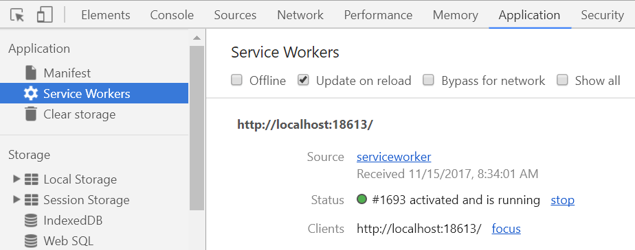
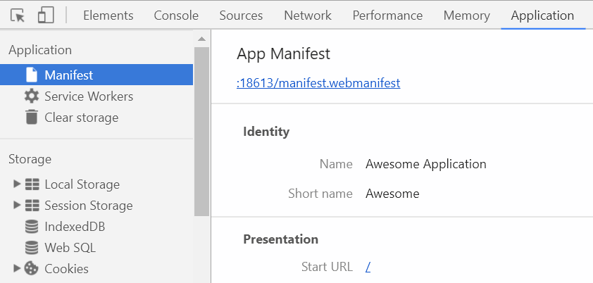

# ASP.NET Core Progressive Web Apps

[](https://ci.appveyor.com/project/madskristensen/webessentials-aspnetcore-serviceworker)
[](https://nuget.org/packages/WebEssentials.AspNetCore.PWA/)

A [Progressive Web App](https://developers.google.com/web/progressive-web-apps/) (PWA) is a set of technologies that can be applied to any type of website and web application, and it consist of 3 components:

1. Any website served over HTTPS
2. A [Web App Manifest](http://www.w3.org/TR/appmanifest/) (simple JSON file)
3. A [Service Sorker](https://developers.google.com/web/fundamentals/primers/service-workers/) JavaScript file

This components makes Web App Manifest a natural and integrated part of any ASP.NET Core web application and it comes with pre-built service workers so you don't have to write your own.


Building Progressive Web Apps have never been easier!

## Install
To add the PWA service to your ASP.NET Core 2.0 application, simply add the NuGet package [WebEssentials.AspNetCore.PWA](https://www.nuget.org/packages/WebEssentials.AspNetCore.PWA/).

Either do that through Visual Studio's NuGet Package Manager or the command line like this:

```cmd
dotnet add package WebEssentials.AspNetCore.PWA
```

## Getting started
You need to do a few things to turn your website into a PWA:

1. Add two image icons (192x192 and 512x512)
2. A `manifest.json` file in the root of the `wwwroot` folder
3. Register a service in `Startup.cs`
4. Make sure it works

### Step 1 - Icons
Get as many icons in various sizes as you want, but you MUST have both a 192x192 and a 512x512 size icon. Use PNG or JPEG. 

Place the icons somewhere in the `wwwroot` folder. 

> Listing the size in the file names makes them easy to identify. Example: `wwwroot/img/icon192x192.png`

### Step 2 - manifest JSON file
Add the file `wwwroot/manifest.json` to your project and fill it in. It could look like this:

```json
{
  "name": "Awesome Application",
  "short_name": "Awesome",
  "description": "The most awesome application in the world",
  "icons": [
    {
      "src": "/img/icon192x192.png",
      "sizes": "192x192"
    },
    {
      "src": "/img/icon512x512.png",
      "sizes": "512x512"
    }
  ],
  "display": "minimal-ui",
  "start_url": "/"
}
```

Read more about the various properties in the [W3C specificiation](http://www.w3.org/TR/appmanifest/).

### Step 3 - register the service
Inside the `ConfigureServices` method in `Startup.cs`, add a call to `services.AddProgressiveWebApp()` like so:

```c#
public void ConfigureServices(IServiceCollection services)
{
    services.AddMvc();
    services.AddProgressiveWebApp();
}
```

> A `WebManifest` object is now available in the Dependency Injection system in ASP.NET Core that allows you to access the contents of the manifest.json file through the strongly typed object.

You are now done converting your website into a PWA!

### Step 4 - verify it works
If you've followed steps 1-3 then it's time to run your app in the browser and test that it is in fact a PWA. Here's how to verify it works:

**Launch the app** in the Chrome browser.

**View source** and ensure the following elements are present in `<head>`:

```html
<link rel="manifest" href="/manifest.webmanifest" />
```

The file name is `manifest.webmanifest` and not `manifest.json` because this component is handling the request instead of serving `manifest.json` directly as a static file.

If you filled in the property `theme_color` in `manifest.json` then you'll also see this meta tag:

```html
<meta name="theme-color" content="#ffffff" />
```

Just before the `</body>` end tag you'll see a script tag registering the service worker:

```html
<script>'serviceWorker'in navigator&&navigator.serviceWorker.register('/serviceworker')</script>
```

**Open the Chrome developer tools (F12)** and navigate to the **Application** tab and select **Service Workers**. It should look somehting like this:



If you see a service worker listed, then it was registered successfully. You may have to refresh the page in the browser to see it.

> Pro tip: Make sure to check the checkbox name **Update on reload** for a better development time experience.

Clicking **Manifest** should show something like this:



If you see both the service worker and the manifest information then it's all working and you have now successfully converted your site to a PWA!

## Customize


## Customizing the Web App Manifest
You can use the Web App Manifest alone without the service worker by calling `services.AddWebAppManifest()` instead of `services.AddProgressiveWebApp()`.

```c#
public void ConfigureServices(IServiceCollection services)
{
    services.AddMvc();
    services.AddWebAppManifest();
}
```

By default it looks for a file named `manifest.json` in the `wwwroot` folder, but you can change the file name to whatever you like - just make sure it is located in the root of the `wwwroot` folder.

If you name it `manifest.webmanifest` then you are bypassing the middleware that handles the serving of the file and instead using the Static File middleware like it was any other static file. This can be desired for certain cases, but if you're in doubt then don't name it `manifest.webmanifest`. 

## Customizing the service worker
You can use the service worker alone without the Web App Manifest by calling `services.AddServiceWorker()` instead of `services.AddProgressiveWebApp()`.

```c#
public void ConfigureServices(IServiceCollection services)
{
    services.AddMvc();
    services.AddServiceWorker();
}
```

### Configure the service worker
The options can be configured either in `Startup.cs`:

```c#
public void ConfigureServices(IServiceCollection services)
{
    services.AddMvc();
    services.AddServiceWorker(new PwaOptions
    {
        CacheId = "v3",
        RoutesToPreCache = "foo.css, bar.js"
    });
}
```

...or in `appsettings.json`:

```json
{
  "pwa": {
    "cacheId": "v1.0",
    "routesToPreCache": "foo.css, bar.js"
  }
}
```

## Caching strategies
Specify which caching strategy you want to use if you want a different one than the default (CacheFirstSafe):

```c#
public void ConfigureServices(IServiceCollection services)
{
    services.AddMvc();
    services.AddServiceWorker(new PwaOptions
    {
        Strategy = ServiceWorkerStrategy.CacheFirst
    });
}
```

...or in `appsettings.json`:

```json
{
  "serviceworker": {
    "strategy": "cacheFirst"
  }
}
```

The options are:

### CacheFirst
This strategy will add all requested resources to the service worker cache and serve it from the cache every time. If the cache doesn't have the requested resource it will fall back to the network and if that succeeds it will put the response in the cache.

### CacheFirstSafe (default)
This strategy adds only HTML files as well as resources with a `v` querystring parameter such as `site.css?v=8udsfsaufd09sud0809sd_ds` to the cache.

It will always attempt the network for HTML files (content type `text/html`) and fall back to the cache when the user is offline. That way the user always gets the latest from the live Internet when online.

For the resources (the ones with a `v` querystring parameter) it will always try the cache first and fall back to the network.

### Minimal
The minimal strategy does nothing and is good for when you only want a service worker in order for browsers to suggest installing your Progressive Web App. For this to work, you need to add a [web manifest](https://medium.com/dev-channel/how-to-add-a-web-app-manifest-and-mobile-proof-your-site-450e6e485638) file.

### NetworkFirst
This strategy will always try the network first for all resources and then fall back to the cache when offline. When the network call succeeds, it will put the response in the cache.

This strategy is completely safe to use and is primarily useful for offline-only scenarios since it isn't giving any performance benefits.